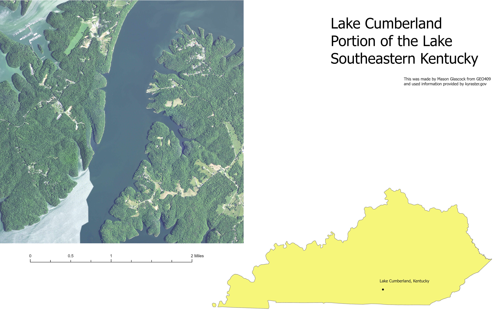

# Lake Cumberland
## Lake Cumberland is located throughtout mutliple parts of southeastern Kentucky

The section I choose was a section of the lake where you can most parts of the lake and also inland sections of it

     
Here is a custom layout of Lake Cumberland which shows the section and also where this is located

[Link to close up](closeup.pdf)     

This map was created by Mason Glascock from University of Kentucky in GEO409. The source I used for this map was from kyraster.gov. The applications used to see Lake Cumberland better were ArcGIS Pro and blender to get the high resolution image of the map.